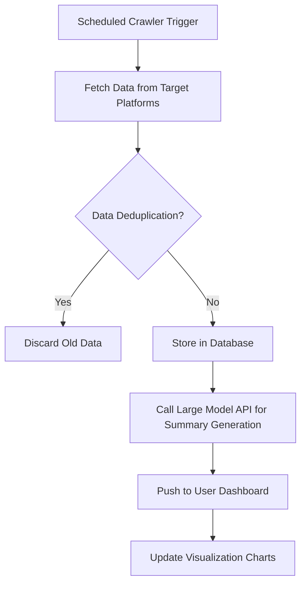

# AutoLitTrack: Automated Literature Tracking & Smart Summarization System

  
[](https://opensource.org/licenses/MIT)  
[](https://github.com/Ran-code000/AutoLitTrack/issues)  

---

## 🌟 **Project Background and Objectives**

In scientific research and academia, staying updated with the latest papers, technological breakthroughs, and industry trends is crucial. However, traditional manual search methods (e.g., browsing platforms like arXiv) are inefficient, requiring researchers to spend significant time on keyword filtering, webpage navigation, and content organization.

This project aims to develop an **Automated Literature Tracking and Smart Summarization System** to optimize the process of acquiring research information through the following approaches:

- 🕷️ **Automated Crawling**: Based on user-defined keywords, daily retrieval of the latest literature from target platforms (e.g., arXiv, CNKI, IEEE Xplore).  
- 🤖 **Smart Summarization**: Utilize large language model APIs (e.g., GPT-4, Claude, Wenxin Yiyan) to perform structured extraction of literature content and generate concise summaries.  
- 📬 **Personalized Notifications**: Deliver categorized information to users via a visual interface (Web/App), supporting multi-dimensional filtering and interaction.  
- 🧠 **Agent Optimization**: In the future, incorporate intelligent agent technology to dynamically learn user preferences and automatically adjust retrieval strategies.

### **Ultimate Goals**
- 🚀 **Short-Term**: Develop a Minimum Viable Product (MVP) supporting core literature tracking and summarization functionalities.  
- 🌍 **Long-Term**: Build a comprehensive research workflow platform, integrating features like literature management, collaborative analysis, and trend forecasting.

---

## 🏗️ **System Architecture Design**

### **2.1 Core Modules**
| **Module**                   | **Function Description**                                                                 |
|------------------------------|------------------------------------------------------------------------------------------|
| 📥 **Data Acquisition Layer**    | A crawler scheduler (Scrapy/Selenium) for targeted data retrieval from platforms, supporting anti-scraping measures and incremental updates. |
| 🧹 **Data Processing Layer**     | Clean raw data (deduplication, format standardization), extract key fields like title, author, abstract, DOI, etc. |
| 📝 **Smart Summarization Layer** | Use large model APIs to generate structured summaries (e.g., "Core Contribution," "Method Innovation," "Potential Limitations"), supporting multilingual output. |
| 🖥️ **User Interaction Layer**    | Web/App frontend offering keyword management, literature categorization, and visualizations (e.g., trending keyword clouds, timeline trends). |
| 📢 **Notification Service Layer**| Daily summary reports via email/in-app notifications, supporting RSS subscriptions or API integration with third-party tools (e.g., Notion, Zotero). |

### **2.2 Technology Stack Selection**
| **Component**         | **Options**                                                                 |
|-----------------------|-----------------------------------------------------------------------------|
| 🕸️ **Crawler Framework**  | Scrapy (efficient), Playwright (dynamic pages), arXiv API (official interface) |
| 🤖 **Large Model API**    | OpenAI GPT-4, Anthropic Claude, domestic models (Wenxin Yiyan, Tongyi Qianwen) |
| ⚙️ **Backend Service**    | FastAPI (lightweight RESTful), Django (full-featured framework)            |
| 🗄️ **Database**           | PostgreSQL (relational), MongoDB (unstructured literature storage),SQLite         |
| 🌐 **Frontend**           | React/Vue.js (Web), Flutter (cross-platform App), Tailwind CSS                          |
| ☁️ **Deployment**         | Docker containerization + AWS/GCP cloud services, or domestic Alibaba Cloud/Tencent Cloud, Vercel (Frontend)|

---

## 🔑 **Key Features and Workflow**

### **3.1 User-Side Features**
1. 🔍 **Keyword Management**  
   - Users input domain-specific keywords (e.g., "deep learning," "gene editing"), supporting Boolean logic (AND/OR/NOT) combinations.  
   - Optional prebuilt domain templates (e.g., computer science, biomedicine) with auto-suggested keywords.  

2. 📄 **Literature Summary Display**  
   - Daily updated lists sorted by relevance or date, with filtering options (e.g., "top conference papers only," "within the last week").  
   - Example summary template:  
     ```markdown
     **Title**: [Protein Design Optimization Using Diffusion Models]  
     **Authors**: Zhang et al. (Nature Biotechnology, 2024)  
     **Core Contribution**: Proposed a novel diffusion framework, improving protein generation speed by 40%, with experimentally validated stability surpassing traditional methods.  
     **Technical Highlight**: Introduced geometric constraint loss function to address folding path conflicts.  
     **Potential Limitation**: Requires GPU clusters, leading to high computational costs.
     ```

3. 📊 **Visual Analysis**  
   - Generate trending keyword clouds, author collaboration networks, and technology trend timelines.  
   - Support for exporting reports in CSV/PDF formats.

### **3.2 Backend Automation Workflow**


---

## ⚠️ **Potential Challenges and Solutions**
| **Challenge**                     | **Solution**                                                                 |
|-----------------------------------|------------------------------------------------------------------------------|
| 🚫 **Platform Anti-Scraping Restrictions** | Use rotating proxy IPs, simulate browser behavior (Playwright), prioritize open APIs (e.g., arXiv). |
| 💸 **Large Model Cost Control**        | Pre-extract key sentences (TF-IDF/BERT) before summary generation to reduce token usage; offer a free tier with daily limits. |
| 🌐 **Multilingual Literature Processing** | Integrate translation APIs (e.g., DeepL) to support mixed Chinese-English summaries. |
| 🔒 **User Privacy and Data Security**  | Comply with GDPR/domestic regulations, encrypt user data, provide anonymous keyword mode. |

---

## 🚀 **Future Expansion Directions**
1. 🧠 **Agent Optimization**  
   - Dynamically learn user reading preferences, adjusting summary detail levels (e.g., "technical details first" or "conclusion-focused").  
   - Intelligently recommend potential collaborators or cross-disciplinary research topics.  
2. 🤝 **Collaboration Features**  
   - Team-shared keyword libraries, supporting annotations and literature discussions.  
3. 💰 **Commercialization Path**  
   - Free basic features, with subscriptions for advanced features (e.g., custom models, private deployment).  
   - Provide API services for universities/enterprises, integrating with internal research management systems.

---

## 📝 **Note**  
This document can serve as a foundational framework for a Product Requirements Document (PRD) or technical proposal, with further refinement needed for module interface definitions and development schedules.

---

## ⏳ **Appendix: Preliminary Timeline**
- 🕒 **1 Week**: Complete MVP (crawler + basic webpage).  
- 🕔 **3 Weeks**: Enhance features (visualizations + user system).  
- 🕕 **6 Weeks**: Launch a stable version and explore commercialization.

---

## 📜 **License**  
This project is licensed under the [MIT License](LICENSE).

## 📬 **Contact**  
For inquiries or feedback, please open an issue on GitHub or reach out via my [GitHub profile](https://github.com/Ran-code000).

---

🌿 Branching Strategy

master Branch: Always contains the latest stable version of the project, reflecting the most up-to-date and integrated codebase.


Module-Specific Branches: Different branches store the development of individual modules (e.g., data-acquisition, summarization, frontend). These branches are updated and merged into master as development progresses through various stages.


Stage Updates: Each branch will receive commits corresponding to its development phase, ensuring modular and organized progress.

*Empowering Research with Automation and Intelligence.*
