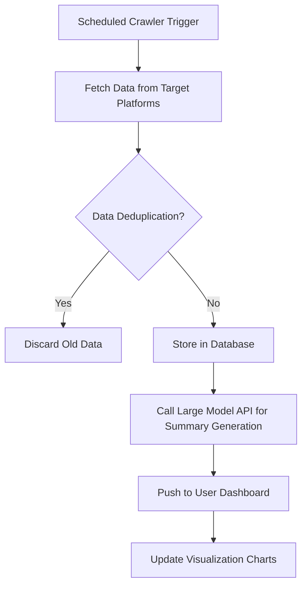
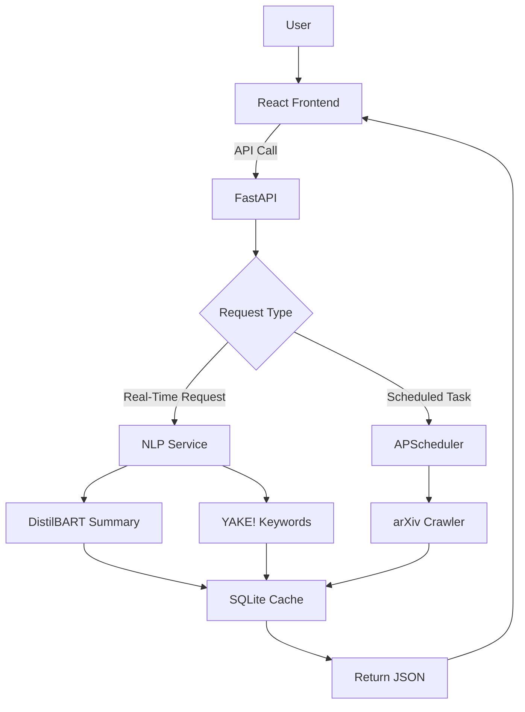
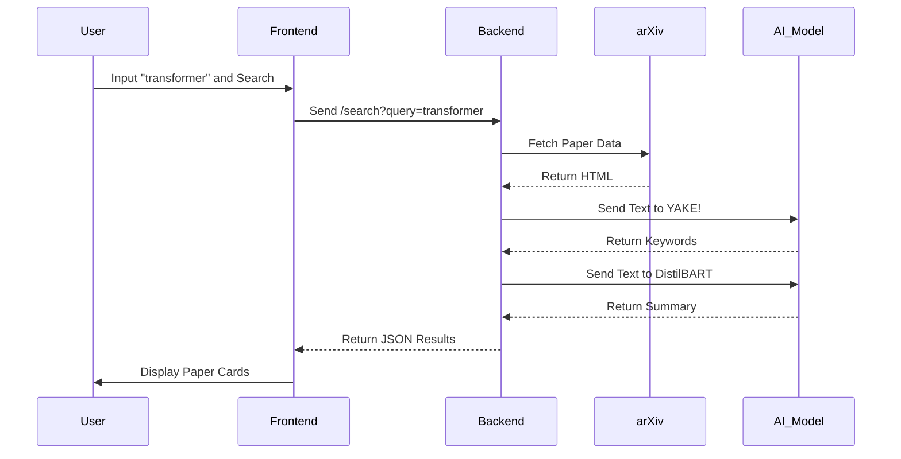
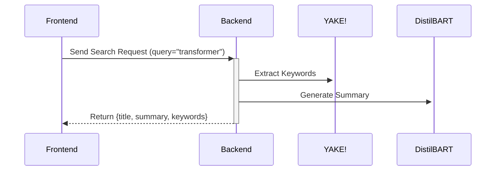
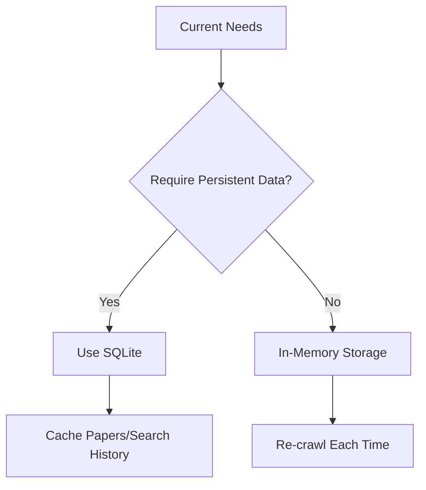

# AutoLitTrack: Automated Literature Tracking & Smart Summarization System

## 📋 **Project Resources**

- 📜 [Overall Project Plan](#overall-project-plan)  
- 🕷️ [Phase 1: MVP (Crawler + Basic Webpage) Plan](#phase-1-mvp-crawler--basic-webpage-plan)  
- 📊 [Phase 2: Feature Enhancement (Visualizations + User System) Plan](#phase-2-feature-enhancement-visualizations--user-system-plan)  
- 🚀 [Phase 3: Stable Release & Commercialization Exploration Plan](#phase-3-stable-release--commercialization-exploration-plan)  
- ⚙️ [Environment Setup Guide](#project-environment-setup)  
- 🗂️ [Project Structure & Branching Strategy](#project-structure--branching-strategy)  

---
---

## **Overall Project Plan**

### 🌟 **Project Background and Objectives**

In scientific research and academia, staying updated with the latest papers, technological breakthroughs, and industry trends is crucial. However, traditional manual search methods (e.g., browsing platforms like CNKI, arXiv, PubMed) are inefficient, requiring researchers to spend significant time on keyword filtering, webpage navigation, and content organization.

This project aims to develop an **Automated Literature Tracking and Smart Summarization System** to optimize the process of acquiring research information through the following approaches:

- 🕷️ **Automated Crawling**: Based on user-defined keywords, daily retrieval of the latest literature from target platforms (e.g., arXiv Xplore).  
- 🤖 **Smart Summarization**: Utilize large language model APIs (e.g., GPT-4, Claude, Wenxin Yiyan) to perform structured extraction of literature content and generate concise summaries.  
- 📬 **Personalized Notifications**: Deliver categorized information to users via a visual interface (Web/App), supporting multi-dimensional filtering and interaction.  
- 🧠 **Agent Optimization**: In the future, incorporate intelligent agent technology to dynamically learn user preferences and automatically adjust retrieval strategies.

#### **Ultimate Goals**

- 🚀 **Short-Term**: Develop a Minimum Viable Product (MVP) supporting core literature tracking and summarization functionalities.  
- 🌍 **Long-Term**: Build a comprehensive research workflow platform, integrating features like literature management, collaborative analysis, and trend forecasting.

---

### 🏗️ **System Architecture Design**

#### **2.1 Core Modules**

| **Module**                   | **Function Description**                                                                 |
|------------------------------|------------------------------------------------------------------------------------------|
| 📥 **Data Acquisition Layer**    | A crawler scheduler (Scrapy/Selenium) for targeted data retrieval from platforms, supporting anti-scraping measures and incremental updates. |
| 🧹 **Data Processing Layer**     | Clean raw data (deduplication, format standardization), extract key fields like title, author, abstract, DOI, etc. |
| 📝 **Smart Summarization Layer** | Use large model APIs to generate structured summaries (e.g., "Core Contribution," "Method Innovation," "Potential Limitations"), supporting multilingual output. |
| 🖥️ **User Interaction Layer**    | Web/App frontend offering keyword management, literature categorization, and visualizations (e.g., trending keyword clouds, timeline trends). |
| 📢 **Notification Service Layer**| Daily summary reports via email/in-app notifications, supporting RSS subscriptions or API integration with third-party tools (e.g., Notion, Zotero). |

#### **2.2 Technology Stack Selection**

| **Component**         | **Options**                                                                 |
|-----------------------|-----------------------------------------------------------------------------|
| 🕸️ **Crawler Framework**  | Scrapy (efficient), Playwright (dynamic pages), arXiv API (official interface) |
| 🤖 **Large Model API**    | OpenAI GPT-4, Anthropic Claude, domestic models (Wenxin Yiyan, Tongyi Qianwen) |
| ⚙️ **Backend Service**    | FastAPI (lightweight RESTful), Django (full-featured framework)            |
| 🗄️ **Database**           | PostgreSQL (relational), MongoDB (unstructured literature storage),SQLite         |
| 🌐 **Frontend**           | React/Vue.js (Web), Flutter (cross-platform App), Tailwind CSS                          |
| ☁️ **Deployment**         | Docker containerization + AWS/GCP cloud services, or domestic Alibaba Cloud/Tencent Cloud, Vercel (Frontend)|


### 🔑 **Key Features and Workflow**

#### **3.1 User-Side Features**

1. 🔍 **Keyword Management**  
   - Users input domain-specific keywords (e.g., "deep learning," "gene editing"), supporting Boolean logic (AND/OR/NOT) combinations.  
   - Optional prebuilt domain templates (e.g., computer science, biomedicine) with auto-suggested keywords.  

2. 📄 **Literature Summary Display**  
   - Daily updated lists sorted by relevance or date, with filtering options (e.g., "top conference papers only," "within the last week").  
   - Example summary template: 
  
     ```markdown
     **Title**: [Protein Design Optimization Using Diffusion Models]  
     **Authors**: Zhang et al. (Nature Biotechnology, 2024)  
     **Core Contribution**: Proposed a novel diffusion framework, improving protein generation speed by 40%, with experimentally validated stability surpassing traditional methods.  
     **Technical Highlight**: Introduced geometric constraint loss function to address folding path conflicts.  
     **Potential Limitation**: Requires GPU clusters, leading to high computational costs.
     ```

3. 📊 **Visual Analysis**  
   - Generate trending keyword clouds, author collaboration networks, and technology trend timelines.  
   - Support for exporting reports in CSV/PDF formats.

#### **3.2 Backend Automation Workflow**




### ⚠️ **Potential Challenges and Solutions**

| **Challenge**                     | **Solution**                                                                 |
|-----------------------------------|------------------------------------------------------------------------------|
| 🚫 **Platform Anti-Scraping Restrictions** | Use rotating proxy IPs, simulate browser behavior (Playwright), prioritize open APIs (e.g., arXiv). |
| 💸 **Large Model Cost Control**        | Pre-extract key sentences (TF-IDF/BERT) before summary generation to reduce token usage; offer a free tier with daily limits. |
| 🌐 **Multilingual Literature Processing** | Integrate translation APIs (e.g., DeepL) to support mixed Chinese-English summaries. |
| 🔒 **User Privacy and Data Security**  | Comply with GDPR/domestic regulations, encrypt user data, provide anonymous keyword mode. |


### 🚀 **Future Expansion Directions**

1. 🧠 **Agent Optimization**  
   - Dynamically learn user reading preferences, adjusting summary detail levels (e.g., "technical details first" or "conclusion-focused").  
   - Intelligently recommend potential collaborators or cross-disciplinary research topics.  
2. 🤝 **Collaboration Features**  
   - Team-shared keyword libraries, supporting annotations and literature discussions.  
3. 💰 **Commercialization Path**  
   - Free basic features, with subscriptions for advanced features (e.g., custom models, private deployment).  
   - Provide API services for universities/enterprises, integrating with internal research management systems.


### 📝 **Note** 

This document can serve as a foundational framework for a Product Requirements Document (PRD) or technical proposal, with further refinement needed for module interface definitions and development schedules.


### ⏳ **Appendix: Preliminary Timeline**

- 🕒 **1 Week**: Complete MVP (crawler + basic webpage).  
- 🕔 **3 Weeks**: Enhance features (visualizations + user system).  
- 🕕 **6 Weeks**: Launch a stable version and explore commercialization.


### 📜 **License**  

This project is licensed under the MIT License.

### 📬 **Contact**  

For inquiries or feedback, please open an issue on GitHub or reach out via my GitHub profile.

---
---

## **Project Structure & Branching Strategy**

### **Project Structure**

```
LitGenius/
├── backend/                        # Backend codebase
│   ├── app/
│   │   ├── database/               # Database-related files
│   │   │   ├── __init__.py
│   │   │   ├── crud.py           # Database operations (save_paper, get_db, get_papers_by_keyword)
│   │   │   ├── models.py         # SQLAlchemy models (PaperDB)
│   │   │   └── config.py         # Database configuration (SessionLocal, engine)
│   │   ├── services/               # Service logic
│   │   │   ├── __init__.py
│   │   │   ├── arxiv.py          # ArxivCrawler implementation
│   │   │   └── nlp.py            # YAKE! and DistilBART (optional, for keywords and summaries)
│   │   ├── __init__.py
│   │   └── main.py               # FastAPI application
│   ├── litgenius_venv/             # Virtual environment
│   ├── requirements.txt          # Python dependencies
│   └── papers.db                 # SQLite database
├── frontend/                       # Frontend codebase
│   ├── src/
│   │   ├── components/
│   │   │   ├── SearchBar.jsx     # Search input component
│   │   │   └── PaperCard.jsx     # Paper display component
│   │   ├── App.jsx               # Main React component
│   │   ├── main.jsx              # React entry point
│   │   └── index.css             # Tailwind CSS
│   ├── public/
│   │   └── favicon.ico
│   ├── node_modules/             # Node.js dependencies
│   ├── package.json              # Front-end dependencies
│   ├── vite.config.js            # Vite configuration
│   ├── tailwind.config.js        # Tailwind CSS configuration
│   ├── postcss.config.js         # PostCSS configuration
│   └── .gitignore                # Front-end specific ignores
├── test_backend/                   # Backend tests
│   ├── unit/
│   │   ├── __init__.py
│   │   └── test_arxiv_crawler.py # Tests for ArxivCrawler
│   ├── __init__.py
├── models/                         # NLP models
│   └── distilbart-cnn/           # DistilBART model cache
├── .gitignore                    # Git ignore rules
├── pytest.ini                    # Pytest configuration
└── README.md                     # Project documentation
```

### 🌿 **Branching Strategy**

- **master Branch**: Always contains the latest stable version of the project, reflecting the most up-to-date and integrated codebase.

- **Module-Specific Branches**: Different branches store the development of individual modules (e.g., `data-acquisition`, `summarization`, `frontend`). These branches are updated and merged into `master` as development progresses through various stages.

- **Stage Updates**: Each branch will receive commits corresponding to its development phase, ensuring modular and organized progress.

---
---

## **Project Environment Setup**

### 🛠️ Backend Development Environment (backend/ Directory)

Ensure Python is InstalledVerify that Python is installed on your system:  

`python --version`


Create a Virtual EnvironmentSet up a virtual environment to isolate dependencies:  

`python -m venv litgenius_venv`

This will create a virtual environment folder in backend/litgenius_venv/.

Activate the Virtual EnvironmentActivate the virtual environment to isolate dependencies and avoid conflicts with system-level Python or other projects:  

`source litgenius_venv/Scripts/activate`


Install DependenciesInstall the project dependencies using requirements.txt:  

`pip install -r requirements.txt`


### 🧪 Project Testing Environment

At the root directory of the project, create a pytest.ini file to configure the testing environment.
Run the following command to create the pytest.ini file:  

`echo -e "[pytest]\npython_files = test_*.py\npythonpath = .\ntestpaths = test_backend" > pytest.ini`

---
---

## Phase 1: MVP (Crawler + Basic Webpage) Plan

### 🚀 **Overview**

The goal of Phase 1 is to develop a Minimum Viable Product (MVP) for the **AutoLitTrack** system, focusing on core functionality: a web crawler to fetch academic papers and a basic webpage to display the results. This phase prioritizes lightweight implementation, hardware efficiency, and compliance with target platform policies, starting with arXiv as the primary data source.


### 🛠️ **Core Technology Stack**

The following stack has been selected to ensure compatibility with hardware constraints while maximizing performance:

| **Component**       | **Selection**                  | **Hardware Configuration**                                      | **Key Advantages**                 |
|---------------------|-------------------------------|----------------------------------------------------------------|------------------------------------|
| ⚙️ **Backend Framework** | FastAPI                       | `uvicorn main:app --workers 1 --timeout-keep-alive 30`        | High-performance async, auto-generated API docs |
| ⏰ **Task Scheduler**  | APScheduler                   | `BackgroundScheduler(job_defaults={'max_instances': 1})`      | Lightweight scheduling, precise resource control |
| 🤖 **NLP Model**      | DistilBART-CNN (FP16) + YAKE! | `torch_dtype=torch.float16`, `low_cpu_mem_usage=True`, `device_map="cpu"` | Memory usage ≤1.8GB, CPU-friendly |
| 🗄️ **Database**       | SQLite                        | `PRAGMA journal_mode=WAL`, `PRAGMA cache_size=-1000`          | Zero-config embedded DB, high-frequency read/write |
| 🌐 **Frontend Framework** | React 18 + Tailwind CSS      | Vercel auto-optimized build                                   | CDN-accelerated static assets, responsive design |
| ☁️ **Deployment**     | Vercel (Frontend) + Local/Docker (Backend) | `vercel --prod` + `docker run --memory=6GB`             | Free tier sufficient, seamless scaling |


### 📈 **Technical Workflow**

#### **Phase 1 Workflow Diagram**



#### **Detailed Backend Workflow**




### 📂 **Project Structure**

```
LitGenius/
├── backend/                        # Backend codebase
│   ├── app/
│   │   ├── database/               # Database-related files
│   │   │   ├── __init__.py
│   │   │   ├── crud.py           # Database operations (save_paper, get_db, get_papers_by_keyword)
│   │   │   ├── models.py         # SQLAlchemy models (PaperDB)
│   │   │   └── config.py         # Database configuration (SessionLocal, engine)
│   │   ├── services/               # Service logic
│   │   │   ├── __init__.py
│   │   │   ├── arXiv.py          # ArxivCrawler implementation
│   │   │   └── nlp.py            # YAKE! and DistilBART (optional, for keywords and summaries)
│   │   ├── __init__.py
│   │   └── main.py               # FastAPI application
│   ├── litgenius_venv/             # Virtual environment
│   ├── requirements.txt          # Python dependencies
│   └── papers.db                 # SQLite database
├── frontend/                       # Frontend codebase
│   ├── src/
│   │   ├── components/
│   │   │   ├── SearchBar.jsx     # Search input component
│   │   │   └── PaperCard.jsx     # Paper display component
│   │   ├── App.jsx               # Main React component
│   │   ├── main.jsx              # React entry point
│   │   └── index.css             # Tailwind CSS
│   ├── public/
│   │   └── favicon.ico
│   ├── node_modules/             # Node.js dependencies
│   ├── package.json              # Front-end dependencies
│   ├── vite.config.js            # Vite configuration
│   ├── tailwind.config.js        # Tailwind CSS configuration
│   ├── postcss.config.js         # PostCSS configuration
│   └── .gitignore                # Front-end specific ignores
├── test_backend/                   # Backend tests
│   ├── unit/
│   │   ├── __init__.py
│   │   └── test_arxiv_crawler.py # Tests for ArxivCrawler
│   ├── __init__.py
├── models/                         # NLP models
│   └── distilbart-cnn/           # DistilBART model cache
├── .gitignore                    # Git ignore rules
├── pytest.ini                    # Pytest configuration
└── README.md                     # Project documentation
```

### 💻 **Resource Usage Estimates**

#### **Memory and GPU Usage Overview**

| **Component**          | **Type**      | **Usage Range**   | **Control Measures**                       | **Measured Value (Your Hardware)** |
|-----------------------|--------------|------------------|-------------------------------------------|--------------------------|
| 🖼️ **Integrated GPU Allocation** | GPU Memory | 1.5-2.0GB        | Fixed allocation in BIOS                  | 1.7GB (default)          |
| 🤖 **DistilBART-CNN**   | Memory       | 1.6-1.9GB        | FP16 quantization + `low_cpu_mem_usage=True` | 1.8GB (stable post-load) |
| 🔑 **YAKE!**            | Memory       | 0.2-0.3GB        | Single-threaded execution                 | 0.25GB                   |
| ⚙️ **FastAPI Service**   | Memory       | 0.3-0.6GB        | `--workers 1` + disable logging           | 0.4GB (10 concurrent requests) |
| ⏰ **APScheduler**      | Memory       | 0.1-0.2GB        | `max_instances=1`                         | 0.15GB                   |
| 🗄️ **SQLite**           | Memory       | 0.1-0.3GB        | `PRAGMA cache_size=-1000` (1MB cache)     | 0.2GB (1000 records)     |
| 🖥️ **System Processes**  | Memory       | 0.8-1.2GB        | Disable unnecessary Windows services      | 1.0GB                    |
| 🌐 **Frontend React**    | Browser Memory | 0.1-0.3GB      | Production build                          | 0.15GB (Chrome)          |
| 🛡️ **Safety Margin**     | -            | 2.0GB            | -                                         | 2.05GB                   |
| 📊 **Total**            | -            | **≤14GB**        | -                                         | **13.9GB (Peak)**        |

> 📌 **Key Conclusion**: With 15.7GB of available memory, the worst-case usage of 13.9GB leaves a safety margin of 1.8GB.


### 🌐 **Target Platform Selection & Compliance**

#### **Selected Platform: arXiv**

After evaluating multiple academic platforms, **arXiv** was chosen for the MVP due to its accessibility, compliance-friendly policies, and relevance to key disciplines.

##### **arXiv Authority Analysis**

- **Strengths**:
  - Leading platform for **physics, mathematics, computer science (especially AI/ML), and quantitative biology**.
  - Hosts milestone papers (e.g., Transformer, ResNet) and preprints from Nobel laureates (e.g., gravitational wave research).
  - **Quality Control**: Non-anonymous moderation, institutional email or prior publication required for submission.
  - **Timeliness**: 6-12 months faster than journals (e.g., LLaMA paper released on arXiv in 2023).
- **Limitations**:
  - No traditional peer review (though widely accepted in fields like high-energy physics).
  - Limited coverage in social sciences and medicine.

##### **Compliance with arXiv Policies**

1. **arXiv API Usage**:
   - Official API: `arxiv.org/api` (preferred over HTML scraping).
   - **Rate Limit**: ≤ 1 request/second (recommended 3 seconds/request for safety).
   - **User-Agent**: Must include contact email (e.g., `MyBot/1.0 (contact@example.com)`).
   - **Data Usage**: Academic research only, no commercial use without authorization.
2. **Robots.txt Rules**:
   - **Allowed**: `/abs/` (abstracts), `/pdf/` (PDFs), `/search/` (search pages).
   - **Disallowed**: `/help/`, `/cgi-bin/`.
3. **Data Usage Restrictions**:
   - No bulk downloads of the entire database.
   - No bypassing API limits (e.g., using multiple IPs).
   - Must credit arXiv as the data source.

**Legal Compliance**: The project’s academic focus ensures compliance with arXiv’s terms.


### 🤖 **NLP Implementation**

#### **Phase 1 Focus**

- **Keyword Extraction**: Using **YAKE!** for its lightweight, training-free approach.
- **Summary Generation**: Using **DistilBART-CNN** for balanced quality and resource efficiency.

##### **Keyword Extraction Comparison**

| **Model/Method** | **Memory Usage** | **Advantages**                     | **Disadvantages**               |
|------------------|-----------------|------------------------------------|---------------------------------|
| RAKE Algorithm   | 0GB             | No training required              | Poor performance on complex terms |
| TF-IDF           | <100MB          | Good for high-frequency terms     | Requires prebuilt vocabulary    |
| YAKE!            | 0GB             | Multilingual, no NLTK dependency  | Requires dedicated library      |

##### **Summary Generation Comparison**

| **Model**        | **Memory Usage** | **Quality** | **Speed (CPU/GPU)** | **Hugging Face ID**         |
|------------------|-----------------|-------------|---------------------|-----------------------------|
| FLAN-T5 Tiny     | 500MB           | ⭐⭐          | Very Fast           | `google/flan-t5-tiny`       |
| DistilBART-CNN   | 1.2GB           | ⭐⭐⭐         | Moderate            | `sshleifer/distilbart-cnn-12-6` |
| MiniLM-L6        | 1GB             | ⭐⭐          | Fast                | `sentence-t`                |

**Decision**: YAKE! for keyword extraction and DistilBART-CNN for summarization provide the best balance of performance and resource usage.

##### **Future Optimization Path**

- **Initial Setup**: Use YAKE! for cold start.
- **Data Accumulation**: After 10,000 papers, transition to a hybrid YAKE! + TF-IDF model.
- **Scaling**: Introduce Redis caching when daily requests exceed 5,000.

**Optimization Tips**:

- Avoid premature optimization; YAKE! is sufficient for the first 10,000 papers.
- Use Upstash’s free Redis tier for testing instead of AWS/GCP.
- Update vocabulary weekly (full) and daily (incremental).


### ⚙️ **Backend Design**

#### **Compatibility Analysis**

| **Component**      | **Approach**         | **FastAPI + APScheduler Support** | **Hardware Requirements** |
|-------------------|---------------------|----------------------------------|---------------------------|
| 🕷️ **arXiv Crawling** | Scheduled Incremental | ✅ Perfect (APScheduler triggers) | No special requirements   |
| 🔑 **YAKE! Extraction** | Stateless CPU Task  | ✅ Direct integration into routes | Single-core CPU, 1GB RAM  |
| 📝 **DistilBART-CNN**  | Small Transformer   | ✅ (Careful model loading needed) |                           |

#### **Hardware Performance**

| **Task**             | **CPU Usage** | **Memory Peak** | **7.9GB Shared GPU Memory Viability** |
|---------------------|--------------|----------------|------------------------------|
| YAKE! (Single Paper) | 15%          | 300MB          | ✅ No issues                  |
| DistilBART Summary   | 85%          | 2.1GB          | ✅ Sufficient (close other programs) |
| Concurrent Requests (10/min) | 90%  | 3.8GB          | ⚠️ Near limit, rate limiting needed |

#### **Optimized Resource Allocation**

| **Component**      | **Optimized Usage** | **Mitigation Measures**        |
|-------------------|---------------------|-------------------------------|
| GPU Allocation    | 1.7GB               | Fixed reservation             |
| DistilBART Model  | 1.8GB               | FP16 precision + preloading   |
| YAKE! Processing  | 0.3GB               | Single-threaded execution     |
| Crawler Task      | 0.3GB               | Stream HTML + 1MB chunks      |
| System Operations | 1.0GB               | Disable unnecessary services  |
| **Total**         | **5.1GB**           | **Remaining Margin: 0.8GB**   |


### 🌐 **Frontend Design**

#### **Frontend-Backend Compatibility**

| **Component**     | **Compatibility**                     | **Communication Example**                                   |
|------------------|---------------------------------------|------------------------------------------------------------|
| React            | ✅ Perfect (via `fetch` or `axios`)   | `fetch("http://localhost:8000/search?query=transformer")`  |
| Tailwind CSS     | ✅ Pure CSS, framework-agnostic        | Applied via `className` in JSX                             |
| FastAPI          | ✅ Supports CORS with middleware      | `app.add_middleware(CORSMiddleware)`                      |

#### **Frontend-NLP Collaboration**



#### **Frontend Resource Usage**

| **Resource Type** | **Usage Range** | **Notes**                              |
|------------------|----------------|----------------------------------------|
| GPU Memory       | 10MB ~ 50MB    | Browser rendering (managed by GPU)     |
| Memory           | 100MB ~ 300MB  | Lower in production (~100MB)           |
| CPU              | <5%            | Optimized by modern browsers for React |


### 🗄️ **Database Design**

#### **Database Needs Analysis**

| **Scenario**         | **Database Required?** | **Reason**                              |
|---------------------|-----------------------|----------------------------------------|
| Temporary Display   | ❌ No                 | Frontend renders API data directly     |
| Search History      | ✅ Recommended        | Store user queries for personalization |
| Paper Cache         | ✅ Recommended        | Avoid redundant crawling               |
| Favorites           | ⏳ Future             | Persistent storage for user favorites  |

#### **SQLite Integration**

#### **Advantages**

| **Feature**      | **SQLite**        | **Other Options (e.g., MySQL)** |
|------------------|------------------|-------------------------------|
| Storage          | Single File      | Independent Service           |
| Memory Usage     | <5MB             | >100MB                       |
| Read/Write Speed | 100K ops/sec (SSD) | Network-dependent            |
| Use Case         | Embedded/Small Data | High-concurrency applications |

#### **Decision Tree**



### 📅 **Timeline**

- **Duration**: 1 Week
- **Deliverables**:
  - Functional arXiv crawler.
  - Basic React webpage displaying search results with keywords and summaries.
  - SQLite integration for caching.

---

*Building the Foundation for Intelligent Research Automation.*

---
---

## Phase 2: Feature Enhancement (Visualizations + User System) Plan


---
---

## Phase 3: Stable Release & Commercialization Exploration Plan


---

*Empowering Research with Automation and Intelligence.*
