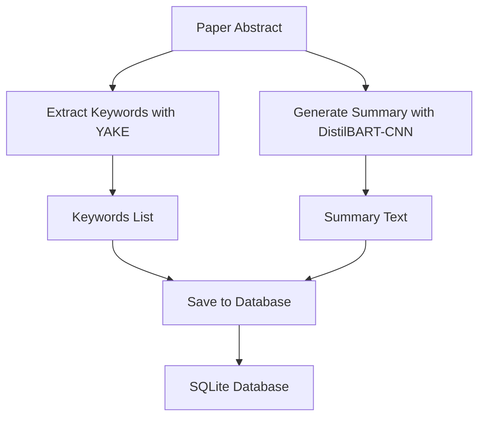

# 🧠 NLP Module: Text Processing for Academic Papers

---

## 📖 **Overview**

The **NLP Module** of the **AutoLitTrack** system enhances the processing of academic paper metadata by providing advanced natural language processing capabilities. It leverages **YAKE** for keyword extraction and **DistilBART-CNN** (via Hugging Face's `transformers`) for text summarization, enabling efficient analysis of paper abstracts. Designed for performance and reliability, this module uses FP16 quantization and supports both CPU and GPU environments.

This module integrates seamlessly with the **Database Module** to store extracted keywords and generated summaries alongside paper metadata, facilitating intelligent search and retrieval.

---

## ✨ **Key Features**

- 🔑 **Keyword Extraction**: Extracts key phrases from abstracts using YAKE, supporting up to bigrams for precise results.
- 📜 **Text Summarization**: Generates concise summaries of abstracts using DistilBART-CNN, optimized with FP16 quantization.
- ⚡ **Performance Optimization**: Supports GPU acceleration (if available) and uses half-precision (FP16) for faster inference.
- ✅ **Robust Testing**: Includes comprehensive unit tests to ensure reliability and correctness.
- 🛠️ **Modular Design**: Easily extensible for additional NLP tasks (e.g., named entity recognition, sentiment analysis).

---

## 🛠️ **Technical Details**

### **Dependencies**

- **Python**: 3.8+
- **Libraries**:
  - `yake`: For keyword extraction.
  - `transformers`: For text summarization (using DistilBART-CNN).
  - `torch`: For model inference (supports GPU acceleration).
  - `pytest`: For running unit tests.
  - `pytest-timeout`: For handling long-running tests (optional).

#### **Setting Up a Virtual Environment (Recommended)**

To avoid dependency conflicts, use a virtual environment:

1. **Create a Virtual Environment**:
   - Using `venv`:
     ```bash
     python -m venv C:/Users/Ran/Desktop/LitGenius/backend/litgenius_venv
     C:/Users/Ran/Desktop/LitGenius/backend/litgenius_venv/Scripts/activate
     ```
   - Or using Conda:
     ```bash
     conda create -n litgenius_venv python=3.12
     conda activate litgenius_venv
     ```

2. **Install Dependencies**:
   ```bash
   pip install yake transformers torch pytest pytest-timeout
   ```

3. **Verify Installation**:
   ```bash
   pip show yake
   pip show transformers
   pip show torch
   ```
   Ensure these packages are installed in the virtual environment (e.g., `C:\Users\Ran\Desktop\LitGenius\backend\litgenius_venv\Lib\site-packages`).

### **Module Structure**

The NLP module is implemented in `backend/app/services/nlp.py` and includes the `NLPProcessor` class with the following key methods:

- `extract_keywords(text: str) -> List[str]`:
  - Uses YAKE to extract up to 5 keywords (bigrams) from the input text.
  - Returns an empty list if the input is empty or an error occurs.

- `generate_summary(text: str, max_length: int = 150, min_length: int = 30) -> Optional[str]`:
  - Uses DistilBART-CNN to generate a summary of the input text.
  - Returns `None` for empty inputs or if an error occurs.
  - Supports FP16 quantization for efficiency.

#### **Data Flow**



#### **Implementation Highlights**

- **YAKE Configuration**:
  - Language: English (`lan="en"`).
  - Maximum n-gram size: 2 (`n=2`).
  - Deduplication threshold: 0.9 (`dedupLim=0.9`).
  - Number of keywords: 5 (`top=5`).

- **DistilBART-CNN Configuration**:
  - Model: `sshleifer/distilbart-cnn-12-6`.
  - Max input length: 1024 tokens (with truncation).
  - Summary length: 30–150 words (`min_length=30`, `max_length=150`).
  - Inference: FP16 quantization, GPU support if available.

---

## 🖥️ **Usage**

### **Example Code**

The NLP module can be used to process paper abstracts and store the results in the database alongside other metadata.

```python
from backend.app.services.nlp import NLPProcessor
from backend.app.database.crud import save_paper, get_db

# Initialize NLPProcessor
nlp = NLPProcessor()

# Sample paper data
paper = {
    "title": "A Survey on Machine Learning Techniques",
    "abstract": (
        "Machine learning is a method of data analysis that automates analytical model building. "
        "It is a branch of artificial intelligence based on the idea that systems can learn "
        "from data, identify patterns and make decisions with minimal human intervention."
    ),
    "link": "https://arxiv.org/abs/1234.5678",
    "published": "2023-01-01T00:00:00Z"
}

# Process the abstract
keyword = "machine learning"
paper["keywords"] = nlp.extract_keywords(paper["abstract"])
paper["summary"] = nlp.generate_summary(paper["abstract"])

# Save to database
db = next(get_db())
saved_paper = save_paper(db, paper, keyword)
print(f"Saved paper: {saved_paper.title}")
print(f"Keywords: {saved_paper.keywords}")
print(f"Summary: {saved_paper.summary}")
```

### **Sample Output**

```
Saved paper: A Survey on Machine Learning Techniques
Keywords: machine learning,artificial intelligence,data analysis,analytical model,learn data
Summary: Machine learning, a branch of artificial intelligence, automates analytical model building by learning from data. It identifies patterns and makes decisions with minimal human intervention.
```

---

## 🧪 **Testing**

The NLP module includes unit tests to ensure the reliability of keyword extraction and summary generation. Tests are located in `test_backend/unit/test_nlp.py`.

### **Run NLP Tests**

From the project root directory, with the virtual environment activated, execute:

```bash
C:/Users/Ran/Desktop/LitGenius/backend/litgenius_venv/Scripts/python -m pytest test_backend/unit/test_nlp.py -v
```

#### **Expected Output**

```
==================================== test session starts ====================================
platform win32 -- Python 3.12.3, pytest-8.3.5, pluggy-1.5.0 -- C:\Users\Ran\Desktop\LitGenius\backend\litgenius_venv\Scripts\python.exe
cachedir: .pytest_cache
rootdir: C:\Users\Ran\Desktop\LitGenius
configfile: pytest.ini
plugins: anyio-4.9.0
collected 5 items

test_backend/unit/test_nlp.py::test_extract_keywords PASSED                       [ 20%]
test_backend/unit/test_nlp.py::test_generate_summary PASSED                      [ 40%]
test_backend/unit/test_nlp.py::test_extract_keywords_empty_input PASSED          [ 60%]
test_backend/unit/test_nlp.py::test_generate_summary_empty_input PASSED          [ 80%]
test_backend/unit/test_nlp.py::test_generate_summary_long_input PASSED           [100%]

===================================== 5 passed in X.XXs ======================================
```

#### **Test Details**

- **Fixtures**:
  - `nlp_processor`: Initializes an `NLPProcessor` instance, forcing CPU usage for testing to avoid GPU-related issues in CI environments.

- **Test Cases**:
  - `test_extract_keywords`: Verifies that YAKE extracts relevant keywords from a sample text.
  - `test_generate_summary`: Tests summary generation using DistilBART-CNN, ensuring key concepts are retained.
  - `test_extract_keywords_empty_input`: Ensures keyword extraction handles empty input gracefully.
  - `test_generate_summary_empty_input`: Ensures summary generation returns `None` for empty input.
  - `test_generate_summary_long_input`: Tests summary generation with a long input, ensuring truncation works.

- **Dependencies**:
  - Relies on `backend.app.services.nlp` module.
  - Uses `pytest`, `yake`, `transformers`, and `torch`.

---

## 📊 **Performance & Resource Usage**

The NLP module is optimized for efficiency while maintaining accuracy:

- **Keyword Extraction (YAKE)**:
  - Latency: <1 second for typical abstracts (500 words).
  - Memory Usage: Minimal (~10 MB).

- **Summary Generation (DistilBART-CNN)**:
  - Latency: 5–30 seconds on CPU, 1–5 seconds on GPU (for 500-word abstracts).
  - Memory Usage: ~1 GB (FP16 mode), ~2 GB (FP32 mode).
  - Optimization: Uses FP16 quantization and supports GPU acceleration.

- **Hardware Fit**: Suitable for systems with at least 4 GB RAM. GPU recommended for faster summarization.

---

## 🛠️ **Development Notes**

### **Error Handling**

- **Keyword Extraction**:
  - Returns an empty list if the input is empty or an error occurs.
  - Logs errors for debugging (e.g., `Error extracting keywords: ...`).

- **Summary Generation**:
  - Returns `None` if the input is empty or an error occurs.
  - Logs errors for debugging (e.g., `Error generating summary: ...`).
  - Handles truncation for inputs exceeding 1024 tokens.

### **Troubleshooting**

- **Error: `ValueError: Unable to compare versions for tqdm>=4.27: need=4.27 found=None`**:
  - This error occurs when `transformers` cannot detect the installed version of `tqdm`, often due to environment conflicts or corrupted metadata.
  - **Solution**:
    1. **Ensure Virtual Environment is Used Correctly**:
       - Activate the virtual environment:
         ```bash
         C:/Users/Ran/Desktop/LitGenius/backend/litgenius_venv/Scripts/activate
         ```
       - Verify the Python executable:
         ```bash
         where python
         ```
         It should point to `C:\Users\Ran\Desktop\LitGenius\backend\litgenius_venv\Scripts\python.exe`.
       - Run pytest with the virtual environment’s Python:
         ```bash
         C:/Users/Ran/Desktop/LitGenius/backend/litgenius_venv/Scripts/python -m pytest test_backend/unit/test_nlp.py -v
         ```
    2. **Remove User-Site Packages**:
       ```bash
       deactivate
       python -m pip uninstall tqdm transformers -y --user
       C:/Users/Ran/Desktop/LitGenius/backend/litgenius_venv/Scripts/activate
       ```
    3. **Reinstall Dependencies**:
       ```bash
       pip uninstall tqdm transformers torch -y
       pip cache purge
       pip install tqdm transformers torch
       ```
    4. **Disable User-Site Packages**:
       ```bash
       set PYTHONNOUSERSITE=1
       C:/Users/Ran/Desktop/LitGenius/backend/litgenius_venv/Scripts/python -m pytest test_backend/unit/test_nlp.py -v
       ```
    5. **Recreate the Virtual Environment (if necessary)**:
       ```bash
       deactivate
       rmdir /S /Q C:\Users\Ran\Desktop\LitGenius\backend\litgenius_venv
       python -m venv C:/Users/Ran/Desktop/LitGenius/backend/litgenius_venv
       C:/Users/Ran/Desktop/LitGenius/backend/litgenius_venv/Scripts/activate
       pip install yake transformers torch pytest pytest-timeout
       ```

- **Slow Tests: `test_generate_summary_long_input`**:
  - **Symptom**: The test takes too long (e.g., several minutes).
  - **Solution**:
    1. Reduce the input size:
       ```python
       long_text = SAMPLE_TEXT * 5  # Reduced multiplier
       ```
    2. Optimize model parameters:
       ```python
       summary_ids = self.model.generate(
           inputs["input_ids"],
           max_length=100,
           min_length=20,
           length_penalty=1.0,
           num_beams=2,
           early_stopping=True
       )
       ```
    3. Use `pytest-timeout` to prevent hangs:
       ```bash
       pip install pytest-timeout
       ```
       ```python
       @pytest.mark.timeout(300)
       def test_generate_summary_long_input(nlp_processor):
           long_text = SAMPLE_TEXT * 5
           summary = nlp_processor.generate_summary(long_text)
           assert len(summary) > 0
           assert len(summary) < len(long_text)
       ```

- **Error: `RuntimeError: CUDA out of memory`**:
  - **Symptom**: Occurs when running on GPU with insufficient memory.
  - **Solution**:
    1. Switch to CPU:
       ```python
       nlp = NLPProcessor()
       nlp.device = "cpu"
       nlp.model = nlp.model.to("cpu")
       ```
    2. Reduce batch size or input length in `generate_summary`.

### **Future Improvements**

- Add support for other NLP tasks (e.g., named entity recognition, topic modeling).
- Implement text chunking for summarization of very long inputs.
- Use a lighter model (e.g., `facebook/bart-large-cnn`) for faster testing.
- Add caching for model inference to improve performance.

---

## 📜 **License**

This module is part of the **AutoLitTrack** project and is licensed under the MIT License.

## 📬 **Contact**

For issues or contributions, please open an issue on GitHub or reach out via my GitHub profile.

---

*Enhancing Academic Insights with Intelligent Text Processing.*
