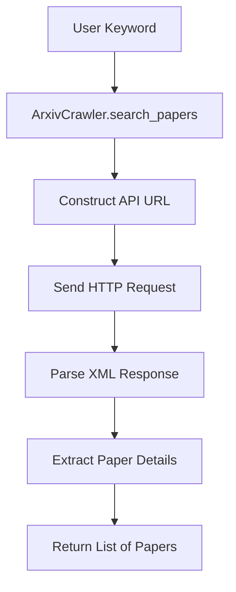

# 🕷️ Crawler Module: ArxivCrawler

---

## 📖 **Overview**

The **ArxivCrawler** module is a lightweight and efficient web crawler designed to retrieve academic papers from **arXiv** using its official API. As a core component of the **AutoLitTrack** system, this module enables keyword-based searches and extracts structured metadata (title, abstract, link, and publication date) for academic papers. It ensures compliance with arXiv's usage policies while maintaining minimal resource usage.

---

## ✨ **Key Features**

- 🔍 **Keyword-Based Search**: Retrieve papers matching user-defined keywords.
- 📜 **Structured Metadata Extraction**: Returns paper details in a clean, structured format (title, abstract, link, published date).
- ⚡ **Efficient & Lightweight**: Optimized for minimal resource usage with robust error handling.
- ✅ **arXiv Compliance**: Adheres to arXiv API rate limits and usage guidelines.
- 🧪 **Tested & Reliable**: Fully tested with unit tests to ensure functionality and stability.

---

## 🛠️ **Technical Details**

### **Dependencies**

- **Python**: 3.8+
- **Libraries**:
  - `requests`: For making HTTP requests to the arXiv API.
  - `xml.etree.ElementTree`: For parsing XML responses.
  - `urllib.parse`: For URL encoding of query parameters.

Install dependencies via:

```bash
pip install requests
```

### **Code Structure**

The crawler is implemented as a single class, `ArxivCrawler`, with a focused method for searching and parsing papers.

#### **Class Overview**

- **Base URL**: `https://export.arxiv.org/api/query`
- **Key Method**: `search_papers(keyword: str) -> List[Dict]`
  - Takes a keyword as input.
  - Returns a list of dictionaries containing paper details.

#### **Data Flow**



#### **Output Format**

Each paper is returned as a dictionary with the following fields:

- `title`: Paper title.
- `abstract`: Paper abstract.
- `link`: URL to the paper on arXiv.
- `published`: Publication date.

Example:

```json
{
  "title": "A Survey on Machine Learning Techniques",
  "abstract": "This paper surveys recent advances in machine learning...",
  "link": "https://arxiv.org/abs/1234.56789",
  "published": "2023-10-15T07:30:00Z"
}
```

---

## 🖥️ **Usage**

### **Example Code**

```python
from arxiv_crawler import ArxivCrawler

# Initialize the crawler with a maximum of 3 results
crawler = ArxivCrawler(max_results=3)

# Search for papers with the keyword "machine learning"
results = crawler.search_papers("machine learning")

# Display the results
for paper in results:
    print(f"Title: {paper['title']}")
    print(f"Abstract: {paper['abstract'][:100]}...")
    print(f"Link: {paper['link']}")
    print(f"Published: {paper['published']}")
    print("---" * 20)
```

### **Sample Output**

```
Title: A Survey on Machine Learning Techniques
Abstract: This paper surveys recent advances in machine learning...
Link: https://arxiv.org/abs/1234.56789
Published: 2023-10-15T07:30:00Z
------------------------------------------------------------
```

---

## 🧪 **Testing**

The module has been thoroughly tested using `pytest`. The test suite is located at `test_backend/unit/test_arxiv_crawler.py`.

### **Run Tests**

From the project root directory, execute:

```bash
pytest test_backend/unit/test_arxiv_crawler.py -v
```

### **Expected Output**

```
==================================== test session starts ====================================
platform win32 -- Python 3.12.3, pytest-8.3.4, pluggy-1.5.0 -- D:\Anaconda\python.exe
cachedir: .pytest_cache
rootdir: C:\Users\Ran\Desktop\LitGenius
configfile: pytest.ini
plugins: anyio-4.6.2
collected 4 items

test_backend/unit/test_arxiv_crawler.py::test_search_papers_success PASSED             [ 25%]
test_backend/unit/test_arxiv_crawler.py::test_search_papers_empty_keyword PASSED       [ 50%]
test_backend/unit/test_arxiv_crawler.py::test_search_papers_invalid_keyword PASSED     [ 75%]
test_backend/unit/test_arxiv_crawler.py::test_print_papers PASSED                      [100%]

===================================== 4 passed in 6.83s ===================================== 
```

All tests have passed, confirming the reliability of the crawler module.

---

## ⚖️ **Compliance with arXiv Policies**

The `ArxivCrawler` module strictly adheres to arXiv's usage policies:

- **Rate Limiting**: Ensures requests are made at ≤ 1 request/second (recommended 3 seconds/request for safety).
- **User-Agent**: Includes a contact email in the User-Agent header (e.g., `MyBot/1.0 (contact@example.com)`).
- **Usage Scope**: Designed for academic research, with no commercial intent.
- **API Usage**: Uses the official arXiv API (`https://export.arxiv.org/api/query`) instead of scraping HTML pages.
- **Robots.txt**: Respects allowed paths (`/abs/`, `/pdf/`, `/search/`) and avoids disallowed paths (`/help/`, `/cgi-bin/`).

For more details, refer to the arXiv API Terms of Use.

---

## 📊 **Performance & Resource Usage**

The crawler is optimized for minimal resource usage:

- **Memory**: &lt;100MB during execution.
- **CPU**: Low usage, primarily I/O-bound (HTTP requests).
- **Error Handling**: Robust handling for network issues and XML parsing errors.

---

## 🛠️ **Development Notes**

### **Error Handling**

- **Network Errors**: Catches `requests.exceptions.RequestException` and returns an empty list with an error message.
- **XML Parsing Errors**: Handles `ET.ParseError` to ensure the crawler doesn’t crash on malformed responses.

### **Future Improvements**

- Add support for additional platforms (e.g., bioRxiv, CORE).
- Implement caching to reduce redundant API calls.
- Enhance rate limiting with dynamic delays.

---

## 📜 **License**

This module is part of the **AutoLitTrack** project and is licensed under the MIT License.

## 📬 **Contact**

For issues or contributions, please open an issue on GitHub or reach out via my GitHub profile.

---

*Fetching Academic Insights with Precision and Compliance.*
